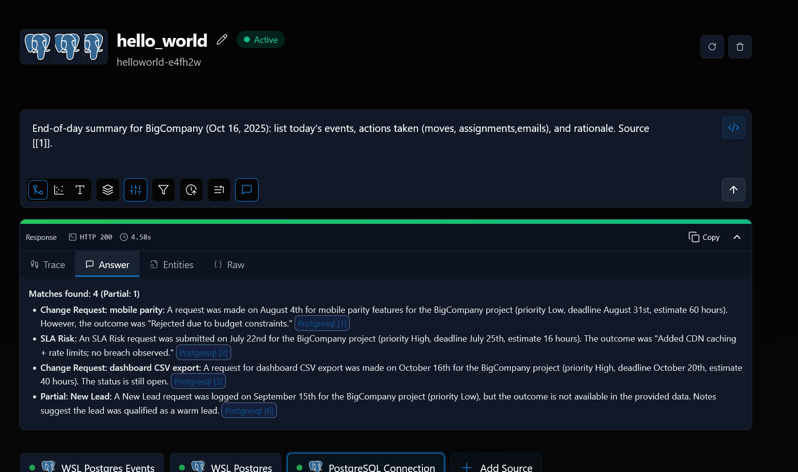

# Airweave Demo Runbook — Team + Events

This runbook seeds a small event history, adds a second Postgres source for events, and shows ready-to-run queries. Everything stays local: Airweave on WSL, Postgres on WSL, inference via Gemma on Windows.

## Prereqs
- Backend healthy: `curl -sS http://localhost:8001/health`
- Collection exists (we use `helloworld-e4fh2w`):
  - `curl -sS http://localhost:8001/collections/ | jq .`
- Existing sources OK (optional):
  - `curl -sS 'http://localhost:8001/source-connections?collection=helloworld-e4fh2w' | jq .`

## 1) Seed Events + View (WSL → Postgres)
Run from repo root (or adjust path):

```bash
psql -h localhost -U postgres -d postgres -f airweave/sql/seed_project_events.sql
```

Notes:
- If password is set (default in `.env` is `smederevo026` for development), either export `PGPASSWORD` or enter when prompted:
  - `export PGPASSWORD=smederevo026`

## 2) Create Events Source (Source B)
Create a new Postgres source for the events view only:

```bash
curl -sS -X POST 'http://localhost:8001/source-connections' -H 'Content-Type: application/json' --data '{"short_name":"postgresql","readable_collection_id":"helloworld-e4fh2w","name":"WSL Postgres Events","authentication":{"credentials":{"host":"host.docker.internal","port":5432,"database":"postgres","user":"postgres","password":"smederevo026","schema":"public","tables":"project_event_history_text"}},"sync_immediately":true}'
```

If `host.docker.internal` doesn’t resolve in your Docker, use the Windows IP as seen from WSL:

```bash
WINDOWS_IP=$(awk '/nameserver/ {print $2; exit}' /etc/resolv.conf)
curl -sS -X POST 'http://localhost:8001/source-connections' -H 'Content-Type: application/json' --data '{"short_name":"postgresql","readable_collection_id":"helloworld-e4fh2w","name":"WSL Postgres Events","authentication":{"credentials":{"host":"'"$WINDOWS_IP"'","port":5432,"database":"postgres","user":"postgres","password":"smederevo026","schema":"public","tables":"project_event_history_text"}},"sync_immediately":true}'
```

Verify sources:

```bash
curl -sS 'http://localhost:8001/source-connections?collection=helloworld-e4fh2w' | jq .
```

## 3) Ready-to-Run Queries (permissive answers with citations)
All examples stream responses; keep each as one physical line.

Team summary (semantic view):

```bash
curl -N -sS -H 'Accept: text/event-stream' -H 'Content-Type: application/json' -X POST 'http://localhost:8001/collections/helloworld-e4fh2w/search/stream' --data '{"query":"Summarize team and costs for project BigCompany.","retrieval_strategy":"hybrid","generate_answer":true,"expand_query":false,"interpret_filters":false,"rerank":false,"filter":{"must":[{"key":"table_name","match":{"value":"project_team_summary_text"}},{"key":"project_name","match":{"value":"BigCompany"}}]}}'
```

Highest rate (employees):

```bash
curl -N -sS -H 'Accept: text/event-stream' -H 'Content-Type: application/json' -X POST 'http://localhost:8001/collections/helloworld-e4fh2w/search/stream' --data '{"query":"Which employee has the highest rate? Return the name and rate.","retrieval_strategy":"hybrid","generate_answer":true,"expand_query":false,"interpret_filters":false,"rerank":false,"filter":{"must":[{"key":"table_name","match":{"value":"employees"}}]}}'
```

Today’s change request (events):

```bash
curl -N -sS -H 'Accept: text/event-stream' -H 'Content-Type: application/json' -X POST 'http://localhost:8001/collections/helloworld-e4fh2w/search/stream' --data '{"query":"What change requests are open for BigCompany today? Summarize impact, risks, and next steps.","retrieval_strategy":"hybrid","generate_answer":true,"expand_query":false,"interpret_filters":false,"rerank":false,"filter":{"must":[{"key":"table_name","match":{"value":"project_event_history_text"}},{"key":"project_name","match":{"value":"BigCompany"}},{"key":"status","match":{"value":"Open"}}]}}'
```

Historical guidance (events only):

```bash
curl -N -sS -H 'Accept: text/event-stream' -H 'Content-Type: application/json' -X POST 'http://localhost:8001/collections/helloworld-e4fh2w/search/stream' --data '{"query":"Based on historical change requests for BigCompany, what risks should we anticipate for the latest request and what mitigations worked previously?","retrieval_strategy":"hybrid","generate_answer":true,"expand_query":false,"interpret_filters":false,"rerank":false,"filter":{"must":[{"key":"table_name","match":{"value":"project_event_history_text"}},{"key":"project_name","match":{"value":"BigCompany"}}]}}'
```

Action plan (AI‑CEO tone):

```bash
curl -N -sS -H 'Accept: text/event-stream' -H 'Content-Type: application/json' -X POST 'http://localhost:8001/collections/helloworld-e4fh2w/search/stream' --data '{"query":"Given the latest change request for BigCompany, propose a one‑day plan with owners, due dates, scope, and communication notes.","retrieval_strategy":"hybrid","generate_answer":true,"expand_query":false,"interpret_filters":false,"rerank":false,"filter":{"must":[{"key":"table_name","match":{"value":"project_event_history_text"}},{"key":"project_name","match":{"value":"BigCompany"}},{"key":"status","match":{"value":"Open"}}]}}'
```

Tip: Additional JSON filters are stored at `airweave/demo_filters/filters.txt`.

## 4) CEO Day — Actions & Decisions

### 4.1 Seed actions/decisions tables and views

```bash
psql -h localhost -U postgres -d postgres -f airweave/sql/seed_actions.sql
```

### 4.2 Create Actions source for the two semantic views

```bash
curl -sS -X POST 'http://localhost:8001/source-connections' -H 'Content-Type: application/json' --data '{"short_name":"postgresql","readable_collection_id":"helloworld-e4fh2w","name":"WSL Postgres Actions","authentication":{"credentials":{"host":"host.docker.internal","port":5432,"database":"postgres","user":"postgres","password":"smederevo026","schema":"public","tables":"performed_actions_text,ceo_decisions_text"}},"sync_immediately":true}'
```

If needed, replace `host.docker.internal` with the Windows IP from `/etc/resolv.conf` as in Section 2.

### 4.3 Insert actions and decisions (examples)

These are plain SQL writes to Postgres; run them after your plan is agreed.

```bash
# Reassign Grace from RND -> BigCompany to cover CSV export
psql -h localhost -U postgres -d postgres -c "\
INSERT INTO public.performed_actions \
  (action_type, actor_employee_id, from_project_id, to_project_id, task, reason, source_event_id, status) \
VALUES \
  ('reassign', \
   (SELECT id FROM public.employees WHERE name='Grace'), \
   (SELECT id FROM public.projects WHERE name='RND'), \
   (SELECT id FROM public.projects WHERE name='BigCompany'), \
   'Move Grace to CSV export workstream', \
   'Cover urgent CSV export', \
   (SELECT event_id FROM public.project_event_history_text \
     WHERE project_name='BigCompany' AND status='Open' AND event_type LIKE 'Change Request:%' \
     ORDER BY requested_at DESC LIMIT 1), \
   'completed');"

# Assign Frank to implement CSV export
psql -h localhost -U postgres -d postgres -c "\
INSERT INTO public.performed_actions \
  (action_type, actor_employee_id, to_project_id, task, reason, status) \
VALUES \
  ('assign', \
   (SELECT id FROM public.employees WHERE name='Frank'), \
   (SELECT id FROM public.projects WHERE name='BigCompany'), \
   'Implement CSV export with filters', \
   'Senior dev leads implementation', \
   'in_progress');"

# Log client email (not actually sent; stored for retrieval)
psql -h localhost -U postgres -d postgres -c "\
INSERT INTO public.performed_actions \
  (action_type, email_to, email_subject, email_body, reason, status) \
VALUES \
  ('email', 'client.a@example.com', 'Status: CSV export request', \
   'We will deliver CSV export by 2025-10-20 with filters; risks: bandwidth; mitigations: reassign Grace, senior review by Frank.', \
   'Client communication', 'sent');"

# Record CEO decision
psql -h localhost -U postgres -d postgres -c "\
INSERT INTO public.ceo_decisions (decision_text, rationale) \
VALUES ('Prioritize CSV export for BigCompany and reassign Grace', \
        'High revenue client; near-term deadline; adequate capacity with Frank + Grace');"
```

### 4.4 Re-sync the Actions source

```bash
curl -sS 'http://localhost:8001/source-connections?collection=helloworld-e4fh2w' | jq .
# Replace SOURCE_ID below with the id of "WSL Postgres Actions"
curl -sS -X POST "http://localhost:8001/source-connections/SOURCE_ID/run"
```

### 4.5 UI inputs for the CEO

- Collection: `helloworld-e4fh2w`
- Retrieval: Hybrid
- Generate Answer: ON
- Query Expansion: OFF
- Rerank: OFF
- Interpret Filters: OFF
- Filter presets to try:
  - `events_open_bigcompany` for what changed today
  - `actions_for_project_bigcompany` to list logged moves/assignments/emails
  - `decisions_all` to review recorded decisions
  - `{}` for an everything view
- Example prompts (natural, local‑only):
  - “What changed today for BigCompany? Summarize impact, risks, and next steps.”
  - “List actions taken for the CSV export request (moves, assignments, emails).”
  - “End‑of‑day summary for BigCompany: events, actions taken, and rationale.”
  - “Who should own the CSV export tomorrow and what are the next steps?”

---

## 5) Consolidate Sources (Single Postgres source for the demo)

You can simplify to ONE source‑connection that serves all relevant views/tables. This keeps the demo tidy and avoids confusion.

### 5.1 Create a consolidated source

```bash
curl -sS -X POST 'http://localhost:8001/source-connections' \
  -H 'Content-Type: application/json' \
  --data '{
    "short_name":"postgresql",
    "readable_collection_id":"helloworld-e4fh2w",
    "name":"WSL Postgres Consolidated",
    "authentication":{
      "credentials":{
        "host":"host.docker.internal",
        "port":5432,
        "database":"postgres",
        "user":"postgres",
        "password":"smederevo026",
        "schema":"public",
        "tables":"project_team_summary_text,employees,project_event_history_text,performed_actions_text,ceo_decisions_text"
      }
    },
    "sync_immediately":true
  }'
```

If `host.docker.internal` is not reachable, replace it with the Windows IP from `/etc/resolv.conf` inside WSL.

### 5.2 (Optional) Remove old source‑connections

List them and pick the two you don’t need (e.g., “WSL Postgres”, “PostgreSQL Connection”, “WSL Postgres Events”).

```bash
curl -sS 'http://localhost:8001/source-connections?collection=helloworld-e4fh2w' | jq .

# Example deletions (replace IDs):
curl -sS -X DELETE 'http://localhost:8001/source-connections/ID_TO_DELETE_1'
curl -sS -X DELETE 'http://localhost:8001/source-connections/ID_TO_DELETE_2'
```

Verify the consolidated source remains and shows entities.

```bash
curl -sS 'http://localhost:8001/source-connections?collection=helloworld-e4fh2w' | jq .
```

---

## 6) How To Demo (End‑to‑Day CEO Flow)

Follow this sequence live; everything stays local (WSL Postgres + Ollama):

- Preflight
  - Health: `curl -sS http://localhost:8001/health`
  - Collection: ensure `helloworld-e4fh2w` exists
  - Consolidated source created and synced (Section 5)

- Quick Event Simulation (optional)
  - Use these one‑liners to simulate fresh events for today, then re‑sync the consolidated source.

  ```bash
  # Acceleration (today): BigCompany asks to accelerate by 5 days
  psql -h localhost -U postgres -d postgres -c "\
  WITH pid AS (SELECT id FROM public.projects WHERE name='BigCompany')
  INSERT INTO public.project_events
    (project_id, client_name, event_type, priority, requested_at, requested_by, description, deadline, estimate_hours, status)
  SELECT id, 'Client A', 'Acceleration', 'High', NOW(), 'PM Team',
         'Accelerate delivery by five days for exec review', NOW() + INTERVAL '5 days', 24, 'Open'
  FROM pid;"

  # New lead (today): inbound request with proposal due in 48h
  psql -h localhost -U postgres -d postgres -c "\
  WITH pid AS (SELECT id FROM public.projects WHERE name='BigCompany')
  INSERT INTO public.project_events
    (project_id, client_name, event_type, priority, requested_at, requested_by, description, estimate_hours, status)
  SELECT id, 'Client B', 'New Lead', 'Low', NOW(), 'Sales',
         'Inbound lead requesting proposal within 48 hours', 8, 'Open'
  FROM pid;"

  # Sick leave (today): availability issue for an engineer
  psql -h localhost -U postgres -d postgres -c "\
  WITH pid AS (SELECT id FROM public.projects WHERE name='BigCompany')
  INSERT INTO public.project_events
    (project_id, client_name, event_type, priority, requested_at, requested_by, description, status)
  SELECT id, 'Client A', 'Availability', 'Medium', NOW(), 'HR',
         'Engineer out sick today; reassign critical tasks', 'Open'
  FROM pid;"

  # Re‑sync consolidated source (replace CONS_SOURCE_ID with id returned in Section 5)
  curl -sS -X POST "http://localhost:8001/source-connections/CONS_SOURCE_ID/run"
  ```

- Observe (Events coming in)
  - Ensure recent events exist (seeded in `seed_project_events.sql`). To simulate more, insert 2–3 additional `project_events` rows and run a quick sync of the consolidated source.
  - UI: Retrieval=Hybrid, Generate Answer=ON, Expansion/Rerank/Interpret=OFF.
  - Filter options:
    - Broad: `{}`
    - Scoped: `{ "must": [{"key":"project_name","match":{"value":"BigCompany"}}] }`
  - Prompt ideas:
    - “What changed today for BigCompany (Oct 16, 2025)? Summarize impact and next steps.”

- Plan (AI proposes actions)
  - Prompt: “For the CSV export request due 2025‑10‑20, propose a one‑day plan with reassignments, owners, and client email draft.”
  - If the UI completion falls back, add a minimal suffix once: `Source [[1]]` (keeps inference natural, just passes the strict gate).

- Act (Write actions/decision)
  - Use the example `psql` inserts in Section 4.3 to log:
    - a reassign (move)
    - an assignment (task)
    - a client email (logged text)
    - a CEO decision (decision + rationale)
  - Re‑sync the consolidated source (Section 4.4, replace SOURCE_ID).

- Log (Summarize end of day)
  - Filter: `{ "must": [{"key":"project_name","match":{"value":"BigCompany"}}] }` (or `{}`)
  - Prompt: “End‑of‑day summary for BigCompany: today’s events, actions taken (moves, assignments, emails), and rationale.”
  - Tip: If a fallback appears, add a tiny suffix once: `Source [[1]]`.

That’s it — you will see a grounded summary driven by local retrieval and local inference, with actions/decisions captured in Postgres and immediately searchable.

## With reasonign 

• Great—since you’re using Ollama (gemma:7b) for answer generation, you can get a concise “reasoning” section by asking the
  model to include a short rationale in the output. Keep Generate Answer ON so the backend routes to Ollama.

  Use this exact prompt and settings:

  - Prompt:
      - End-of-day summary for BigCompany for Oct 16, 2025: list today’s events (incident, new lead, sick leave), actions
        taken (moves, assignments, emails), and rationale. Then add a section titled “Model Reasoning (concise)” with 3–5
        short bullets explaining key signals from the retrieved rows, stated as verifiable justifications (no hidden chain-
        of-thought). Include assumptions, tradeoffs, and a one-line confidence. End with [[1]].
  - Retrieval: Hybrid
  - Generate Answer: ON
  - Expansion: OFF
  - Rerank: OFF
  - Interpret Filters: OFF
  - Filter:
      - {"must":[{"key":"project_name","match":{"value":"BigCompany"}}]}

  Notes

  - This prompts gemma:7b to write a brief reasoning summary (e.g., “We prioritized the incident because it’s ‘High’
    priority and open today; CSV export due 2025‑10‑20 sets timebox; Alice sick → reassignment to Grace”). It avoids step-
    by-step chain-of-thought while still giving clear, auditable justification.
  - Keep the “[[]][1]” suffix to satisfy the UI’s citation gate if needed.
  - Make sure OLLAMA_BASE_URL and OLLAMA_MODEL=gemma:7b are set in airweave/.env (you already have this), and that the
    backend was started with those envs (WSL override path you’re using is fine).

  Optional structured variant (if you prefer stricter formatting)

  - Prompt:
      - Produce Markdown with sections: Events Today, Actions Taken, Rationale, Model Reasoning (concise), Next Steps. In
        “Model Reasoning (concise)”, give 3–5 bullets with evidence-based justifications, one “Assumptions” bullet, and a
        final “Confidence: low/medium/high”. Use only retrieved facts. End with [[1]].

---

## 7) UI Testing Prompts (Generate Answer ON)

Status (Oct 16, 2025)
- Working: EOD CEO, Deliverables, Incident Deep‑Dive, New Lead, Availability, CSV one‑day plan, Client Email, Constraints (with temporal_relevance: 0.0).
- Not yet working: Actions only, Decisions only (see 7.11 for quick fix and alternatives).

Use these ready-to-paste requests in the UI Code panel. Unless noted, keep:
- Retrieval: Hybrid
- Generate Answer: ON
- Expansion: OFF
- Interpret Filters: OFF
- Rerank: ON
- Base filter: {"must":[{"key":"project_name","match":{"value":"BigCompany"}}]}

7.1 End‑of‑Day (CEO) with concise reasoning
```
Query: End-of-day summary for BigCompany for Oct 16, 2025: list today’s events (incident, new lead, sick leave), actions taken (moves, assignments, emails), and rationale. Then add a section titled “Model Reasoning (concise)” with 3–5 short bullets explaining key signals from the retrieved rows, stated as verifiable justifications (no hidden chain-of-thought). Include assumptions, tradeoffs, and a one-line confidence. End with [[1]].
Filter: {"must":[{"key":"project_name","match":{"value":"BigCompany"}}]}
```

7.2 Deliverables (events + actions + decisions)
```
Query: End-of-day deliverables for BigCompany (today). List key events, actions, and decisions. End with [[1]].
Filter: {"must":[{"key":"project_name","match":{"value":"BigCompany"}},{"key":"table_name","match":{"value":"eod_deliverables_text"}}]}
```

7.3 Constraints snapshot (hours-only view)
Note: set temporal_relevance to 0.0 in the Code JSON to avoid recency decay on single-timestamp sets.
```
Body:
{
  "query": "Summarize constraints for BigCompany today. End with [[1]].",
  "retrieval_strategy": "hybrid",
  "generate_answer": true,
  "expand_query": false,
  "interpret_filters": false,
  "temporal_relevance": 0.0,
  "rerank": true,
  "filter": {
    "must": [
      {"key":"project_name","match":{"value":"BigCompany"}},
      {"key":"table_name","match":{"value":"project_constraints_text"}}
    ]
  }
}
```

7.4 Actions only
```
Query: List actions taken for BigCompany today (moves, assignments, emails). End with [[1]].
Filter: {"must":[{"key":"project_name","match":{"value":"BigCompany"}},{"key":"table_name","match":{"value":"performed_actions_text"}}]}
```

7.5 Decisions only
```
Query: What CEO decisions were recorded for BigCompany today? Return decision and rationale. End with [[1]].
Filter: {"must":[{"key":"project_name","match":{"value":"BigCompany"}},{"key":"table_name","match":{"value":"ceo_decisions_text"}}]}
```

7.6 Incident deep‑dive (today)
```
Query: Summarize today’s production incident for BigCompany: impact, status, mitigations, and next steps. End with [[1]].
Filter: {"must":[{"key":"project_name","match":{"value":"BigCompany"}},{"key":"table_name","match":{"value":"project_event_history_text"}},{"key":"event_type","match":{"value":"Incident: critical bug"}}]}
```

7.7 New lead (today) → plan
```
Query: A new lead asked for a proposal within 48 hours. Draft a short plan with owners, discovery questions, and a proposal outline. End with [[1]].
Filter: {"must":[{"key":"project_name","match":{"value":"BigCompany"}},{"key":"table_name","match":{"value":"project_event_history_text"}},{"key":"event_type","match":{"value":"New Lead"}}]}
```

7.8 Availability (today) → reassignment
```
Query: One engineer is out sick today. Recommend task reassignments to keep deadlines on track and note risks. End with [[1]].
Filter: {"must":[{"key":"project_name","match":{"value":"BigCompany"}},{"key":"table_name","match":{"value":"project_event_history_text"}},{"key":"event_type","match":{"value":"Availability"}}]}
```

7.9 CSV export (due 2025‑10‑20) → one‑day plan
```
Query: One‑day plan to deliver Accounts CSV export with filter parity by 2025‑10‑20. Include owners (BE/FE/QA/SRE/PM), milestones, acceptance, and risks. End with [[1]].
Filter: {"must":[{"key":"project_name","match":{"value":"BigCompany"}},{"key":"table_name","match":{"value":"project_event_history_text"}}]}
```

7.10 Client email (status update)
```
Query: Draft a client email for BigCompany summarizing the export incident mitigation and the CSV export plan due Oct 20. Keep it professional and concise. End with [[1]].
Filter: {"must":[{"key":"project_name","match":{"value":"BigCompany"}}]}
```

Tips
- If you see “No relevant information…”, include “End with [[1]]” once to satisfy the citation gate, or widen the filter to the base filter.
- For constraints completions, set temporal_relevance to 0.0 in the Code JSON (or turn the UI’s recency slider to 0).

7.11 Actions/Decisions — quick fixes if no rows appear

Reason: The collection may not be indexing the two standalone views yet. Two options:

- Option A (recommended): create a tiny Postgres source for just the two views, then re‑sync.
  ```bash
  curl -sS -X POST 'http://localhost:8001/source-connections' \
    -H 'Content-Type: application/json' \
    --data '{
      "short_name": "postgresql",
      "readable_collection_id": "helloworld-e4fh2w",
      "name": "WSL Postgres Actions/Decisions",
      "authentication": {"credentials": {
        "host": "host.docker.internal", "port": 5432, "database": "postgres",
        "user": "postgres", "password": "smederevo026", "schema": "public",
        "tables": "performed_actions_text,ceo_decisions_text"
      }},
      "sync_immediately": true
    }'
  ```
  Verify job completion, then retry 7.4 and 7.5.

- Option B (alternative filter via Deliverables): use the combined view with a section filter.
  - Actions only:
    ```
    Query: List actions taken for BigCompany today (moves, assignments, emails). End with [[1]].
    Filter: {"must":[
      {"key":"project_name","match":{"value":"BigCompany"}},
      {"key":"table_name","match":{"value":"eod_deliverables_text"}},
      {"key":"section","match":{"value":"action"}}
    ]}
    ```
  - Decisions only:
    ```
    Query: What CEO decisions were recorded for BigCompany today? Return decision and rationale. End with [[1]].
    Filter: {"must":[
      {"key":"project_name","match":{"value":"BigCompany"}},
      {"key":"table_name","match":{"value":"eod_deliverables_text"}},
      {"key":"section","match":{"value":"decision"}}
    ]}
    ```

## 8) Export as Markdown (Auto‑Download)

### 7.1 Browser (DevTools) — one‑click download

Open the Airweave UI tab, press F12 → Console, paste and run:

```js
(async () => {
  const readableId = 'helloworld-e4fh2w';
  const body = {
    query: 'End-of-day summary for BigCompany (Oct 16, 2025): events, actions taken (moves, assignments, emails), and rationale. Source [[1]].',
    retrieval_strategy: 'hybrid',
    generate_answer: true,
    expand_query: false,
    interpret_filters: false,
    rerank: false,
    filter: { must: [ { key: 'project_name', match: { value: 'BigCompany' } } ] }
  };

  const res = await fetch(`http://localhost:8001/collections/${readableId}/search`, {
    method: 'POST',
    headers: { 'Content-Type': 'application/json' },
    body: JSON.stringify(body)
  });
  const data = await res.json();

  const date = new Date().toISOString().slice(0,10);
  const lines = [];
  lines.push(`# EOD Summary – BigCompany (${date})`);
  if (data.completion) lines.push('', data.completion.trim());
  lines.push('', '## Sources');
  (data.results || []).slice(0, 10).forEach((r, i) => {
    const p = r.payload || {};
    const label = p.summary_text || (p.embeddable_text || '').slice(0,160);
    lines.push(`- [${i+1}] ${p.table_name || ''} — ${label}`);
  });

  const md = lines.join('\n');
  const blob = new Blob([md], { type: 'text/markdown' });
  const a = document.createElement('a');
  a.href = URL.createObjectURL(blob);
  a.download = `EOD_BigCompany_${date}.md`;
  document.body.appendChild(a);
  a.click();
  setTimeout(() => { URL.revokeObjectURL(a.href); a.remove(); }, 1500);
})();
```

Notes:
- If your browser blocks cross‑origin fetches to 8001 from 8080, use the CLI method below.
- If you prefer not to include the small `Source [[1]]` suffix, you can set `generate_answer: false` and the file will still be created from results.

### 7.2 CLI — save EOD Markdown locally

```bash
curl -sS -X POST 'http://localhost:8001/collections/helloworld-e4fh2w/search' \
  -H 'Content-Type: application/json' \
  --data '{"query":"End-of-day summary for BigCompany (Oct 16, 2025): events, actions taken (moves, assignments, emails), and rationale. Source [[1]].","retrieval_strategy":"hybrid","generate_answer":true,"expand_query":false,"interpret_filters":false,"rerank":false,"filter":{"must":[{"key":"project_name","match":{"value":"BigCompany"}}]}}' \
| jq -r '["# EOD Summary – BigCompany ("+ (now|strflocaltime("%Y-%m-%d")) +")", "", (.completion // "No completion"), "", "## Sources", ((.results // [])[:10][] | "- " + (.payload.table_name // "") + " — " + ((.payload.summary_text // .payload.embeddable_text // "") | tostring | .[0:160]))] | join("\n")' \
> "EOD_BigCompany_$(date +%F).md"
```

## 6.1 How TO

• Here’s where each insert shows up and how to verify it.

  Where the new rows appear

  - Event inserts (acceleration, new lead, sick leave)
      - Base table: public.project_events
      - Indexed view: public.project_event_history_text
      - In Airweave, after re-sync, you’ll see results with payload.table_name = "project_event_history_text" (entity type
        will correspond to that view).
  - Action/assignment/email inserts
      - Base table: public.performed_actions
      - Indexed view: public.performed_actions_text
      - In Airweave, payload.table_name = "performed_actions_text".
  - CEO decision inserts
      - Base table: public.ceo_decisions
      - Indexed view: public.ceo_decisions_text
      - In Airweave, payload.table_name = "ceo_decisions_text".

  Which source-connection indexes them

  - If you created the consolidated source (“WSL Postgres Consolidated”) from DEMO_RUNBOOK:
      - It indexes: project_team_summary_text, employees, project_event_history_text, performed_actions_text,
        ceo_decisions_text.
      - After each batch of inserts, run a re-sync for this consolidated source so changes are searchable.
  - If you still have the older sources:
      - Events may also show under the source that included base tables (that’s why you saw both project_events and
        project_event_history_text earlier). With consolidation, the view is the important one.

  Quick checks

  - DB-level (WSL psql):
      - psql -h localhost -U postgres -d postgres -c "SELECT COUNT(*) FROM public.project_event_history_text;"
      - psql -h localhost -U postgres -d postgres -c "SELECT COUNT(*) FROM public.performed_actions_text;"
      - psql -h localhost -U postgres -d postgres -c "SELECT COUNT(*) FROM public.ceo_decisions_text;"
  - API-level (after re-sync):
      - Events: filter on table_name=project_event_history_text
      - Actions: filter on table_name=performed_actions_text
      - Decisions: filter on table_name=ceo_decisions_text

  UI filters to use

  - Events only: {"must":[{"key":"table_name","match":{"value":"project_event_history_text"}}]}
  - Actions only: {"must":[{"key":"table_name","match":{"value":"performed_actions_text"}}]}
  - Decisions only: {"must":[{"key":"table_name","match":{"value":"ceo_decisions_text"}}]}
  - BigCompany scope (any type): {"must":[{"key":"project_name","match":{"value":"BigCompany"}}]}

## 4) Resync After Adding More Events
Find your events source id and run it:

```bash
curl -sS 'http://localhost:8001/source-connections?collection=helloworld-e4fh2w' | jq .
curl -sS -X POST "http://localhost:8001/source-connections/SOURCE_CONNECTION_ID/run"
```

Check jobs:

```bash
curl -sS 'http://localhost:8001/sync/jobs' | jq .
```

## 5) Troubleshooting
- Backend health OK but no answers: verify that sources show a non‑zero `entity_count` and that the events source includes `project_event_history_text`.
- Docker cannot reach Postgres: swap `host.docker.internal` for the Windows IP from `/etc/resolv.conf` inside WSL.
- Auth: local demo assumes `AUTH_ENABLED=false`.
